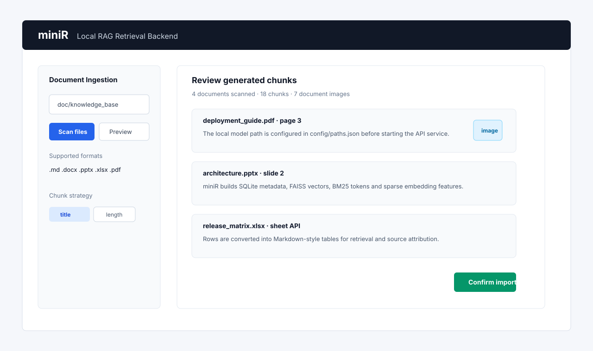
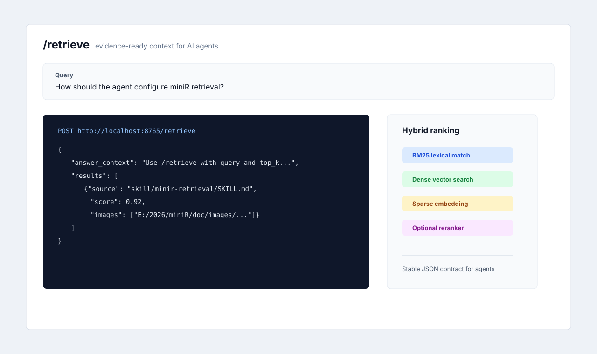

# miniR: Local RAG Retrieval Backend for AI Agents

[English](README.md) | [简体中文](README_zh-CN.md)


miniR is a lightweight, self-hosted RAG retrieval backend for AI agents. It ingests Markdown, Word, PPT, Excel and PDF documents, builds local hybrid indexes, and returns evidence-ready context through REST API or Agent Skill.



## Why miniR

miniR focuses on the retrieval layer only. It does not call an LLM for you. Instead, it turns local documents into searchable evidence and gives agents a stable `/retrieve` API that returns text chunks and related local image paths.

Recommended GitHub topics: `rag`, `retrieval-augmented-generation`, `ai-agent`, `local-first`, `fastapi`, `faiss`, `hybrid-search`, `document-processing`, `knowledge-base`, `python`.

- Multi-format ingestion for `.md`, `.docx`, `.pptx`, `.xlsx` and `.pdf`
- Document-embedded image extraction and preview
- Local SQLite metadata plus FAISS vector index
- Hybrid retrieval with BM25, dense embeddings, sparse embeddings and optional reranking
- Gradio review workflow before committing chunks into the index
- Agent Skill package under `skill/minir-retrieval`

## Screenshots



## Quick Start

Use Python 3.12 or newer. The project is developed and tested with a local conda environment.

```bash
pip install -r requirements.txt
```

Download embedding and reranker models:

```bash
modelscope download --model BAAI/bge-m3 --local_dir modelscope_models/bge-m3
modelscope download --model BAAI/bge-reranker-v2-m3 --local_dir modelscope_models/bge-reranker-v2-m3
```

Start the retrieval API:

```bash
python fastapi_server.py
```

Open API docs at <http://localhost:8765/docs>.

Start the Web UI:

```bash
python web_ui.py
```

Open the UI at <http://localhost:8001>.

## Document Ingestion

The Web UI is the recommended ingestion path because it lets you scan a directory, preview generated chunks, inspect extracted images and confirm before indexing.

The CLI path scans `doc/` by default:

```bash
python scripts/add_documents.py
```

Supported file types:

| Format | Extension | Notes |
| --- | --- | --- |
| Markdown | `.md` | Keeps Markdown text and referenced local images |
| Word | `.docx` | Extracts paragraphs, tables and embedded images |
| PowerPoint | `.pptx` | Extracts slide text, notes and embedded images |
| Excel | `.xlsx` | Converts sheets into Markdown-style table text |
| PDF | `.pdf` | Extracts readable page text and embedded images |

Standalone image files are not indexed as documents. Images are preserved only when they are referenced by or embedded in supported documents. OCR and multimodal image understanding are intentionally out of scope for v0.1.0.

## Retrieval API

```bash
curl -X POST http://localhost:8765/retrieve \
  -H "Content-Type: application/json" \
  -d "{\"query\":\"What does the deployment guide say?\",\"top_k\":5}"
```

The response format is stable for agents: it returns evidence-ready text, source metadata and image paths when a matching chunk has document images.

## Agent Skill

miniR includes an agent-ready skill package:

```text
skill/minir-retrieval/
```

Copy or reference this folder from Codex, Claude Code or other compatible agents. The skill contains usage instructions, API contract notes and helper scripts for health checks and retrieval formatting.

## Project Layout

```text
mini-rag/
├── fastapi_server.py        # REST retrieval service
├── web_ui.py                # Gradio ingestion and management UI
├── scripts/                 # ingestion, index and document management tools
├── skill/minir-retrieval/   # agent skill package
├── tests/                   # parser and ingestion tests
├── config/                  # model and runtime paths
├── doc/                     # local documents, ignored by git
└── faiss_index/             # generated index files, ignored by git
```

## Tests

```bash
python -B -m unittest discover -s tests
```

GitHub Actions runs the same test suite with lightweight parser dependencies.

## Contributing

See [CONTRIBUTING.md](CONTRIBUTING.md). For notable changes, see [CHANGELOG.md](CHANGELOG.md).

## License

miniR is released under the [MIT License](LICENSE).
